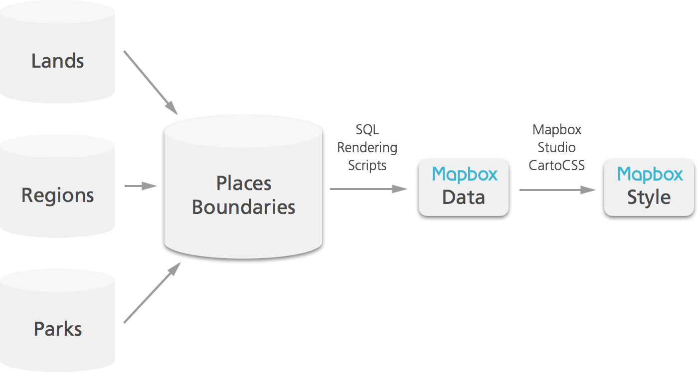

# Places Boundaries


National Park boundaries are rendered into Park Tiles from our own NPMap boundaries database, `places_boundaries`, hosted on internal NPS servers. The geometries for park boundaries come from either the Land Resources Division Database (a.k.a. "Lands"), or directly from the parks themselves if they can provide a more authoritative/politically-appropriate version of their boundary. We store these geometries in our `places_boundaries` database and attach a number of cartographic attributes to help us render boundaries appropriately in our multi-scale Park Tiles basemaps. Thus, the display of park boundaries is controlled by NPMap cartographers, but the actual path of these geometries can only come from parks, regions, or the national Lands database.

## Simplification for multi-scale cartography

Displaying park boundaries in a digital basemap requires careful planning about how each park is displayed and labeled at different zoom levels.

### Geometries

Displaying every detail of a park's boundary can be wasteful at small zoom levels (z0) where these details cannot even be seen by the map user. At the smallest zoom levels, all park boundaries are displayed using a simplified representation: either a **point** or a **line**. While the vast majority of parks are simplified to points, a handful of parks with linear shapes (National Rivers, Parkways, etc.) are simplified into lines. Our database keeps track of which parks are simplified as lines vs. points and stores these simplified geometries.

### Labels

If the map is zoomed out to the full extent (z0), labeling every park would result in a jumbled mess of text, especially in areas like Washington D.C. where many DOI properties lie within a very small area. However, as the map user zooms in on a particular area, more space becomes available for labeling parks. We label parks in an abbreviated version at small scales and a full version at larger scales. For each park NPMap determines the point at which its abbreviated label should appear, and at what point its full label should appear.

### Minimum zoom levels

Each park is displayed in different treatments at different zoom levels. The way we determine at which zoom level a particular treatment should occur is with a minimum zoom value. For example: Rocky Mountain National Park is displayed as a point at zoom level 4 (z4), then as a polygon at z5. Thus the minimum zoom level for its polygon representation is 5. Likewise, at z9 is shows its abbreviated label but at z10 it switches to its full label. Thus the minimum zoom value for its full label is 10. We can use the same logic to determine when parks are labeled, and how park borders are displayed (they become more prominent at larger zoom levels).

With well over 400 properties under NPS management, manually setting all of the minimum zoom values for each park would be awful. Instead, we use a series of SQL scripts applied across all parks to make logical decisions about how and when they should be displayed and labeled. Some of the fields in our database exist purely for the sake of these scripts. However, by exposing the minimum zoom values that result from these scripts, we can manually fine tune these values for parks where our NPS-wide logic wasn't the best solution.

Why not handle this minimum zoom logic in our CartoCSS? Our CartoCSS styles are restricted by file size to keep the tile rendering fast. By hard-coding the minimum zoom logic into our data source, we can write much simpler CartoCSS that says what a park should look like whenever its unique min zoom is triggered. This way, our CartoCSS doesn't have to sort through the logic of *why* certain parks show up before others – all of that logic is determined before the data source is published.

## Boundaries Update Workflow



## Connecting to our PostGIS database

The `places_boundaries` database lives on internal NPS servers. To connect to this database from Terminal or PGAdmin, follow the steps below. Note that you will need to tunnel into the database, which you can do through Terminal or through PGAdmin. If you wish to connect to the database using QGIS, you must tunnel in through terminal.

### Terminal

- Enter `ssh -nNT -L 5432:localhost:5432 <username>@10.147.153.191`
  - Replace `<username>` with your active directory login
  - Remove `-nNT` if you wish to connect only through Terminal
- `Are you sure you want to continue?` answer `yes`
  - You'll only have to do this once.
- Enter your password: `Web mapping for <your first name>!`
- Once you click `enter`, the tunnel will be open
- To close the tunnel, use `ctrl+c`

#### Updating a boundary in PostgreSQL

Run the following in Terminal to *update* a park boundary:

1. Navigate to the directory housing the updated boundary file
1. SFTP into places_boundaries:
 - `sftp username@10.147.153.191` (replace "username" with your username)
1. Copy the local boundary files to the server:
 - `sftp> put boundary.*` (replace "boundary" with appropriate file name)
1. Exit out of SFTP:
 - `sftp> exit`
1. SSH into places_boundaries:
 - `ssh -L:15432:localhost:5432 username@10.147.153.191`
1. Import local boundary via ogr2ogr (MUWO example below, source file `muwo.shp`, table `muwo`):
 - `ogr2ogr -f "PostgreSQL" PG:"host=localhost user=postgres password=postgres dbname=places_boundaries" muwo.shp -nln muwo -nlt MULTIPOLYGON -t_srs EPSG:3857`
1. Confirm that the table has been created successfully:
 - `psql -d places_boundaries -c "\dt"`
1. Replace geometry in `parks_poly` table with new geometry (continuing with MUWO example):
 - `psql -U postgres -d places_boundaries -c "UPDATE parks_poly SET geom_poly = (SELECT ST_Union(wkb_geometry) FROM muwo) WHERE unit_code = 'muwo';"` (remove `ST_Union()` if there is only one row in boundary)
1. Check the log to confirm that query ran properly:
 - In pgAdmin right click `logged_actions` table under `audit` schema and select "view last 100 rows"; first query is most recent
1. Drop source file table (continuing MUWO example):
 - `psql -U postgres -d places_boundaries -c "DROP TABLE muwo;"`
1. Update the `parks` table's `unit_area` and `updated_by` fields, along with the `data_source`if this has changed (continuing MUWO example):
 - `psql -U postgres -d places_boundaries -c "UPDATE parks SET unit_area = (SELECT ST_Area(geom_poly) FROM parks_poly WHERE unit_code = 'muwo'), updated_by = 'Chad Lawlis', data_source = 'Land Resources Division' WHERE unit_code = 'muwo';"`

#### Adding a boundary in PostgreSQL

Run the following in Terminal to *add* a park boundary:

1. Perform steps #1-7 from above "Updating a boundary in PostgreSQL"
1. Populate the `parks` table with park attribute data along with its boundary's area and centroid (THJE example below; table name `thje`):
 - `psql -U postgres -d places_boundaries -c "INSERT INTO parks (unit_id, unit_name_short, unit_name_long, unit_desig_abbr, unit_desig_full, unit_code, unit_area, simp_type, geom_point, data_source, region_code, created_by, updated_by, state, url) values ((select max(unit_id) + 1 from parks), 'Thomas Jefferson', 'Thomas Jefferson', 'MEM', 'Memorial', 'thje', (select ST_Area(wkb_geometry) from thje), 'point', (select ST_Centroid(wkb_geometry) from thje), 'Land Resources Division', 'NCR', 'Chad Lawlis', 'Chad Lawlis', 'District of Columbia', 'http://www.nps.gov/thje/index.htm');"`
 - Remaining fields to be populated by cartography: `unit_rank`, `unit_urban`, `ldir`, `min_zoom_poly`, `min_zoom_border`, `min_zoom_tint_band`, `min_zoom_label`, `min_zoom_label_long`, `min_zoom_label_center`, `ldir_enforce`, `min_zoom_simp`, `max_zoom_label`
1. Populate the `parks_poly` table (continuing THJE example):
 - `psql -U postgres -d places_boundaries -c "INSERT INTO parks_poly VALUES ((select unit_id from parks where unit_code = 'thje'), 'thje', (select wkb_geometry from thje));"`
1. Populate the `parks_line` table (continuing THJE example):
  - `psql -U postgres -d places_boundaries -c "INSERT INTO parks_line VALUES ((select unit_id from parks where unit_code = 'thje'), 'thje');"`
1. Drop the source file table (continuing THJE example):
 - `psql -U postgres -d places_boundaries -c "DROP TABLE thje;"`

### PGAdmin
- If you don't have PGAdmin, you'll need to [download it here](http://www.pgadmin.org/download/).
- Open PGAdmin and find the button for *Add a connection to a server* (top left)
- **New Server Registration** window > **Properties** tab
  - Name: `places_boundaries`
  - Host: `localhost`
  - Port: `5432`
  - Service: *leave blank*
  - Maintenance DB: `postgres`
  - Username: `postgres`
  - Password: `postgres`
  - Store password: *check (optional)*
  - Group: `Servers`  


- **New Server Registration** window > **SSH Tunnel** tab  
  Note: If you already tunneled in through Terminal, entering this info under the **Properties** tab is all you need. If you'd like to tunnel in with PGAdmin, follow these additional steps.
  - Use SSH tunneling: *check*
  - Tunnel host: `10.147.153.191`
  - Tunnel port: 22
  - Username: `<your username>` (active directory login)
  - Authentication: *check the box for Password*
  - Identity file: *leave blank*
  - Password/Passphrase: `Web mapping for <your first name>!`


- Click `OK` – you're in!
- Next time you want to connect, the server settings will be saved in your account. You'll simply have to enter your database password (`postgres`) and your tunneling password (`Web mapping for <your first name>!`).
- Under `Databases` you'll find the `places_boundaries` database.
- Under `Schemas > public > Tables` you'll find our `boundaries` table that holds all the information used to style NPS boundaries in Park Tiles.

### QGIS
It can be helpful to look at our PostGIS tables through QGIS to see what these geometries look like on a map. To connect to our database through QGIS follow these steps:

- Tunnel into our server (see steps above)
- Open QGIS
- Click the "Add PostGIS Layers" button on the left tool panel (elephant icon)
- In the **Add PostGIS Tables(s)** window, click the **New** button.
  - Name: places_boundaries
  - Service: *leave blank*
  - Host: localhost
  - Port: 5432
  - Database: places_boundaries
  - SSL mode: *leave as 'disable'*
  - Username: postgres
  - Password: postgres

- Click **Connect** to see the contents of the DB (you'll have to expand `public` to see your list of connection options.
- Note: QGIS may show different version of the same table if it thinks there are different geometry columns. You'll need to be pretty particular in your selection here. In this example, we'll select the boundaries table using `geom_point` as it's geometry field.
- Select the record `boundaries` table with Column:`geom_point` and Spatial Type:`Multipolygon`.
- With the record selected, click the **Add** button at the bottom left of the window.
- The added layer works like any other. You can toggle Edit mode to move geometries and change attributes. Note: To edit a PostGIS layer, the original table must have a primary key set. Also, QGIS does not support tracking multi-user editing – whoever saves first wins.

### PostGIS Table: `places_boundaries`

Our `places-boundaries` database holds a master table, `boundaries`, from which our boundaries data source is published. The `boundaries` table stores the following fields:

- `unit_id`  
Description: A numeric primary key for Mapbox Studio, and potentially useful if/when we decide to support park sub-units.

- `unit_name_short`    
Description: The simplest version of a park name (without designation). Example: Shenandoah, Grand Canyon, Crater Lake.

- `unit_name_long`   
Description: The longer version of a park name (without designation). In most cases, this is the same as the short name, but there are a few strange cases.

- `unit_desig_short`    
Description: The abbreviated designation for a park, capitalized. Example: NP, NHS, NRA

- `unit_desig_long`   
Description: The fully spelled-out designation for a park. National Park, National Historic Site, National Recreation Area.

- `unit_code`    
Description: The parks four-letter code, lowercase. Example: romo, yell, blri.

- `unit_area`   
Description: The area of the park that could be used for determining initial min zoom setting in a short SQL script run over newly entered park boundaries.    
```SQL
Insert SQL here
```

- `unit_visitors`  
Description: The average number of visitors a park receives per year that could be used for determining initial min zoom setting in a short SQL script run over newly entered park boundaries.
```SQL
Insert SQL here
```

- `unit_rank`  
Description: A rank of relative cartographic prominence of parks that impacts labeling decisions. 1-5 with 1 being the highest ranking and 5 the lowest. (Perhaps unnecessary thanks to min_zoom_label. Maybe more to help us make decisions.)  
```SQL
Insert SQL here
```

- `unit_urban`  
Description: Either true or false. To help determine if a different set of rules should be applied for labeling and styling other features within the park.

- `unit_simplification`  
Description: Either "point" or "line". Should the simplified representation of this park be a point or a polygon?

- `ldir`  
Description: The label direction. Examples: N, S, E, W, NE, SE, SW, NW.  
```SQL
Insert SQL here
```

- `min_zoom_poly`  
Description: The minimum zoom at which a park's representation becomes it's full polygon (before this point, each park defaults to it's indicated simplified representation – either point or line). Note: At this point, a park's simplified representation becomes transparent, but remains in the vector tiles for labeling.  
```SQL
Insert SQL here
```

- `min_zoom_border`  
Description: The minimum zoom at which a park's darker green border is added.  
```SQL
Insert SQL here
```

- `min_zoom_tint_band`  
Description: The minimum zoom at which a park's lighter green tint band is added.  
```SQL
Insert SQL here
```

- `min_zoom_label_short`  
Description: The minimum zoom at which a park's label is shown with an abbreviated designation.  
```SQL
Insert SQL here
```

- `min_zoom_label_long`  
Description: The minimum zoom at which a park's label is shown with it's fully spelled-out designation.  
```SQL
Insert SQL here
```

- `min_zoom_label_center`  
Description: The minimum zoom at which a park's label is shown centered over it's point (must always be an equal or larger number than min_zoom_poly)  
```SQL
Insert SQL here
```

- `geom_poly`
Description: The polygon geometry of the park boundary. Every park in our database must have one.

- `geom_point`  
Description: The point representation of the park, also used for labeling. SQL-generated (Point_On_Surface) from the polygon, but can be moved manually.  
**Note**: We know that CartoDB doesn't like us to store multiple geometries in a table. We just wanted to add this to show our interest.  
```SQL
Insert SQL here
```

- `geom_line`  
Description: The line representation of the park, also used for labeling. SQL-generated from the polygon, btu can be adjusted manually.  
**Note**: We know that CartoDB doesn't like us to store multiple geometries in a table. We just wanted to add this to show our interest.  
```SQL
Insert SQL here
```

- `date_created`  
Description: The date this park was added to our master_boundaries table (essentially, when NPMap started keeping track of the boundary).

- `last_updated`  
Description: The date when this park's polygon was last updated.

- `data_source`  
Description: The source for this park's GIS boundary data. Either Lands, Region, or Park. Should apply to the most recent update.

### SQL Snippets

Some SQL snippets we used to create our table:

```sql
CREATE TABLE boundaries (
  unit_id smallint,
  unit_name_short text, -- *
  unit_name_long text, -- *
  unit_desig_abbr text, -- *
  unit_desig_full text, -- *
  unit_code text, -- *
  unit_area numeric,
  unit_visitors numeric,
  unit_rank smallint,
  unit_urban smallint, -- *
  unit_simplification text,
  ldir text, -- *
  min_zoom_poly smallint, -- *
  min_zoom_border smallint, -- *
  min_zoom_tint_band smallint, -- *
  min_zoom_label_short smallint, -- *
  min_zoom_label_long smallint, -- *
  min_zoom_label_center smallint, -- *
  geom_poly geometry,
  geom_point geometry,
  geom_line geometry
  date_created date,
  last_updated date,
  data_source text),
  -- * = needed for styling in Mapbox Studio
);
```

Some SQL used to populate the table from a legacy boundaries table:

```sql
SELECT
       render_park_labels.tm2_key                                          AS "unit_id",
       render_park_labels.short_name                                       AS "unit_name_short",
       render_park_labels.long_name                                        AS "unit_name_long",
       Regexp_replace(label_points.display_name, '.+\s(\w+?)$', '\1', 'g') AS "unit_desig_abbr",
       label_points.designation                                            AS "unit_desig_full",
       Lower(render_park_labels.unit_code)                                 AS "unit_code",
       render_park_labels.area                                             AS "unit_area",
       label_points.visitors                                               AS "unit_visitors",
       0                                                                   AS "unit_rank",
       render_park_labels.urban_area                                       AS "unit_urban",
       CASE
         WHEN render_park_lines.line_geom IS NULL THEN 'point'
         ELSE 'line'
       end                                                                 AS "unit_simplification",
       render_park_labels.ldir                                             AS "ldir",
       render_park_labels.minzoompoly                                      AS "min_zoom_poly",
       label_points.minzoompoly + 5                                        AS "min_zoom_border",
       label_points.minzoompoly + 6                                        AS "min_zoom_tint_band",
       render_park_labels.show_label_zoom                                  AS "min_zoom_label_short",
       label_points.minzoompoly + 5                                        AS "min_zoom_label_long",
       CASE
         WHEN render_park_labels.minzoompoly <= 9 THEN
         render_park_labels.minzoompoly + 3
         ELSE 100
       end                                                                 AS "min_zoom_label_center",
       label_points.poly_geom                                              AS "geom_poly",
       render_park_labels.point_geom                                       AS "geom_point",
       render_park_lines.line_geom                                         AS "geom_line",
       cartodb_parks.created_at                                            AS "date_created",
       cartodb_parks.updated_at                                            AS "last_updated",
       label_points.poly_source                                            AS "data_source"
FROM   render_park_labels
       JOIN label_points
         ON Lower(render_park_labels.unit_code) = Lower(label_points.unit_code)
       JOIN cartodb_parks
         ON Lower(render_park_labels.unit_code) = Lower(cartodb_parks.unit_code)
       FULL OUTER JOIN render_park_lines
                    ON Lower(render_park_labels.unit_code) = Lower(
                       render_park_lines.unit_code);
```

#### Creating a view to store simplified geometries

Many of our park polygons are far more complex than is necessary at small zoom levels. Writing all these complicated shapes into vector tiles at small scales would make these tiles unnecessarily large – because of this, we use a function to create a view that renders different geometries for each park based on each zoom level. The function ensures that details smaller than 1 pixel for a particular zoom will be simplified.

To add our simplification function:
```sql
insert function
```

To create the simplified view:
```sql
insert sql
```

To update the simplified view (in case a geometry is updated):
```sql
insert sql
```

### Publishing a Mapbox Data Source

To publish a Mapbox data source directly from our `places_boundaries` database, you can connect directly to an instance of Mapbox Studio running on the server from your browser window.

- Connect to Mapbox Studio running on our server here: http://10.147.153.191:3000/
  Note: This will only work if you're on the NPS network.

To publish a data source, we need to add a few names and add a bit more SQL to incorporate our zoom-dependent simplified geometries.

- Add more directions...
